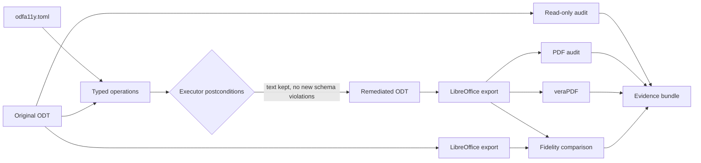

# Architecture

> **A run is: parse once, check or operate on one shared document, emit typed findings
> from one rule registry, and record everything in one run record.**

## Packages and dependency rules

| Package | Responsibility |
| --- | --- |
| `errors` | The domain exceptions; the CLI reports exactly these. |
| `safe_xml` | The one XML parser for untrusted input: no entity expansion, no network. |
| `external_tools` | Locate and identify LibreOffice and veraPDF. |
| `report` | The rule registry, findings, reports, rendering and exit statuses. |
| `odf` | ODT packages, the parsed `OdtDocument`, XML selection, styles, text, bundled schemas. |
| `audit` | Read-only ODT checks and configuration templates. |
| `remediation` | Typed operations and the executor. |
| `pdf` | LibreOffice export, structural PDF audit, veraPDF. |
| `fidelity` | PDF text, link and rendered-ink comparison. |
| `evidence` | Manifests, the review sheet and atomic bundle publication. |
| `config` | The TOML file → operations and fidelity policy. |
| `pipeline` | The ordered stages and the run record. |
| `cli` | Argument parsing and command output. |

Dependencies point one way: `cli` → `pipeline` → `audit`, `remediation`, `pdf`,
`fidelity`, `evidence` → `odf` → the leaves. Those five never import each other, and
`pdf` does not depend on `odf`. [tach.toml](../tach.toml) is the authority: `tach check`
rejects an undeclared dependency, a cycle, or an import that bypasses a package's public
interface, and a package's public API is exactly what its `__init__.py` re-exports.

## The document model

[OdtDocument](../src/odfa11y/odf/document.py) wraps a loaded package and parses each XML
member once. `tree()` reads; `edit()` returns the same tree and marks the member edited.
`save()` re-serializes only edited members, so untouched members stay byte-identical, and
the [package writer](../src/odfa11y/odf/package.py) validates the archive (first,
uncompressed `mimetype`) and replaces the destination atomically. The
[style catalog](../src/odfa11y/odf/styles.py) works on the live trees, and the
[text snapshot](../src/odfa11y/odf/text.py) is read from them, so nothing is re-parsed.

Audit checks use `tree()` only, which is why an audit cannot modify a document.

## Findings and rules

Every finding references a [registered rule](../src/odfa11y/report/rules.py) with its id,
severity, category and *remedy*, the configuration key that holds the decision. Reports
serialize as `{"format": 1, "kind", "subject", "passed", "summary", "metadata", "findings"}`.

## Operations and the executor

An [operation](../src/odfa11y/remediation/outcome.py) is a frozen dataclass: its fields
are its parameters, `apply(document)` returns one `Outcome` per target (`applied`,
`unchanged` or `failed`), and `as_dict()` records it. Applying twice never accumulates
changes. The TOML configuration *is* the plan: declarative, strict and reviewed by a
person; there is no second plan format.

The [executor](../src/odfa11y/remediation/apply.py) applies operations in order and
publishes only if: no outcome failed; every `applied` outcome made at least one `edit()`
(and `unchanged` made none), which catches a lost edit; visible text is preserved apart
from counted spacer removals; and the ODF schema shows no violation the source did not
already have. Failure writes nothing. It also refuses to write over its source.

## Schema validation

The [bundled schemas](../src/odfa11y/odf/schema.py) are unmodified OASIS files with
recorded digests. Violation messages carry no line numbers, so a multiset comparison
before and after an edit identifies violations the edit introduced.

## PDF boundary

[Export](../src/odfa11y/pdf/export.py) and [veraPDF](../src/odfa11y/pdf/verapdf.py) use
argument lists, timeouts and a temporary LibreOffice profile, and publish files
atomically. The [structure walker](../src/odfa11y/pdf/structure_walk.py) builds the
reachable structure tree once; the [checks](../src/odfa11y/pdf/structure_checks.py) read
roles, headings, lists, tables, figures and links from it. veraPDF's XML is parsed into
failed rules with clause, test number and sample contexts; a missing validator, an
execution failure and malformed output are distinct errors, while non-compliance is a
finding.

## Pipeline and evidence

[`run_pipeline`](../src/odfa11y/pipeline/run.py) runs the stages in a fixed order, stops
at the first failed gate and records the rest as skipped. Its
[run record](../src/odfa11y/pipeline/record.py) is serialized without timestamps or
absolute paths and published, with artifacts, review sheet and manifest, as one
[evidence bundle](EVIDENCE.md).

## Packaging

[pyproject.toml](../pyproject.toml) is the authority for metadata, dependencies,
development tool groups and the lint, type and coverage settings, and for Hatchling build
selection. The version is read from [the package initializer](../src/odfa11y/__init__.py),
which holds only the version. The wheel ships `py.typed` and the ODF schemas. See
[Development](DEVELOPING.md#packaging).
