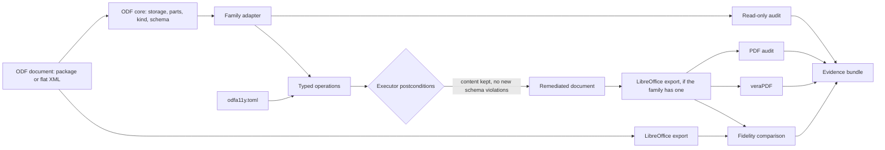

# Architecture

> **The ODF core understands OpenDocument structure; a document family understands what its
> documents mean. No family-specific element name, rule or operation exists outside that
> family's package.**

A run parses a document once, checks or edits that one shared document, emits typed
findings from one rule registry, and records everything in one run record.

## Packages and dependency rules

| Package | Responsibility |
| --- | --- |
| `errors` | The domain exceptions; the CLI reports exactly these. |
| `safe_xml` | The one XML parser for untrusted input: no entity expansion, no network. |
| `staging`, `pdf_limits` | Sibling temporary names for atomic writes; size limits for hostile PDFs. |
| `external_tools` | Locate, identify and run LibreOffice and veraPDF with bounded output. |
| `report` | The rule registry, findings, reports, rendering and exit statuses. |
| `odf` | Storage layouts, logical parts, document kinds, detection, schema validation. |
| `adapter` | The contract between the core and families: `FamilyAdapter`, `Operation`, `Outcome`. |
| `families.text` | Everything specific to text documents: audit rules, operations, styles, plan table. |
| `families.spreadsheet` | Everything specific to spreadsheets: audit rules, operations, snapshot, plan table. |
| `families` | The registry: which adapter serves which kind; the generic adapter for the rest. |
| `audit` | The read-only audit engine: common checks, then the family's. |
| `remediation` | The executor and the operations common to every family. |
| `pdf` | LibreOffice export, structural PDF audit, link correlation, veraPDF. |
| `fidelity` | PDF text, link and rendered-ink comparison. |
| `evidence` | Manifests, redaction, the review sheet and atomic bundle publication. |
| `config` | The TOML file → operations and fidelity policy. |
| `pipeline` | Assurance profiles, the ordered stages and the run record. |
| `cli` | Argument parsing and command output. |

Dependencies point one way: `cli` → `pipeline`, `config` → `audit`, `remediation`, `pdf`,
`fidelity`, `evidence` → `families` → `families.<family>` → `adapter` → `odf` → the leaves.
The five engines never import each other, and **families never import each other**, nor
does anything below the registry import a family. [tach.toml](../tach.toml) is the
authority: `tach check` rejects an undeclared dependency, a cycle, or an import that
bypasses a package's public interface (a package's public API is exactly what its
`__init__.py` re-exports). A quality gate adds the part tach cannot see: it fails when a
core package names a family's XML elements (`qn("text", …)`, `//table:…`).

## The document model

An ODF document is stored as a **package** (a ZIP with a manifest) or as one **flat XML**
file. Both load into an [OdfStorage](../src/odfa11y/odf/storage.py), and everything above
the storage talks to **parts** (`content`, `styles`, `meta`, `settings`, `manifest`), never
to member names: in a package each part is a member, in a flat document every part but the
manifest is the same tree.

[OdfDocument](../src/odfa11y/odf/document.py) parses each XML member once. `tree(part)`
reads; `edit(part)` returns the same tree and marks its member edited. `save()` re-serializes
only edited members, so untouched members stay byte-identical, and the storage validates and
replaces the destination atomically (a package keeps `mimetype` first and stored). Audit
checks use `tree()` only, which is why an audit cannot modify a document.

### Kinds

[kinds.py](../src/odfa11y/odf/kinds.py) lists every OpenDocument media type with its family
(`text`, `spreadsheet`, `presentation`, `graphics`, `formula`, `chart`, `image`,
`database`), template flag and body element, including the deprecated and legacy ones.
[Detection](../src/odfa11y/odf/detect.py) reads the declared media type (the `mimetype` file,
or `office:mimetype` of a flat document, falling back to the manifest), the manifest's
media type, the body element and the file extension. The file extension never selects the
kind; a mismatch is a finding. An unrecognised media type ends the audit with `ODF005`.

## Document families

A family implements a [FamilyAdapter](../src/odfa11y/adapter/family.py): its audit, its
default language (a family's styles decide where one lives), the content snapshot the
executor compares, the plan table it reads, its template lines, its review checklist and,
if LibreOffice can export it to PDF, the export filter. Kinds without an implementation get
the **generic adapter**: the common checks run, an `ODF009` finding says that no semantic
audit exists, and the body text must not change.

Two families are implemented, and neither imports the other:

- `text` (text, templates, master and web documents) owns the `TXT` rules, five operations
  and the `[text]` configuration table.
- `spreadsheet` (`.ods`, `.ots`, flat `.fods`) owns the `SHEET` rules, two operations
  (`SetSheetNames`, `SetObjectAltText`), the `[spreadsheet]` table, the `calc_pdf_Export`
  filter and a snapshot of sheet names and cell text whose `preserved` rule lets only
  sheet names change. It shows that the contract needs nothing from the core about
  spreadsheets: the default language lives on a different style, the snapshot is not
  paragraphs, and the operations resolve sheets and frames instead of paragraphs and
  tables. Its alt-text operation resembles the text family's on purpose; a shared helper
  would have to name `draw:` elements, which only a family package may.

### Adding a family

1. Create `families/<family>/` with an `ADAPTER`, its audit, operations and plan table;
   declare each operation's `family`. Where the family's default language lives, what its
   snapshot is and what `preserved` allows are the family's decisions, not the core's.
2. Add one line to the registry and one `[[modules]]` entry to `tach.toml`.
3. Add `<PREFIX>` rules to the registry and `docs/RULES.md` (a test keeps them equal).
4. Add synthetic fixtures for both layouts to `tests/documents.py` and the family's tests.

Nothing else changes: not `odf`, `audit`, `remediation`, `pipeline`, `evidence`, `config`
or `cli`. A test registers a stand-in adapter through the registry alone to keep that true.
A family's operations are rejected for documents of any other family, so a plan can never
act on a document it was not written for.

## Findings and rules

Every finding references a [registered rule](../src/odfa11y/report/rules.py) with its id,
severity, category and *remedy*, the configuration key that holds the decision. The id's
prefix names its owner: `PKG`, `XML`, `ODF`, `META` (core), `TXT` (text family), `SHEET` (spreadsheet family), `PDF`,
`VERA`, `FID` (outputs). Reports serialize as
`{"format": 3, "kind", "subject", "passed", "summary", "metadata", "findings"}`. A finding's
`location` is `{"path", "member"}` or null: a storage-neutral logical path, and the package
member only where it helps ([locations](RULES.md#locations)).

## Operations and the executor

An [operation](../src/odfa11y/adapter/operation.py) is a frozen dataclass: its fields are its
parameters, `apply(document)` returns one `Outcome` per target (`applied`, `unchanged` or
`failed`), and `as_dict()` records it. Applying twice never accumulates changes. Operations
that need resolving first (alt text, header rows, spacing) resolve and validate every
selector before the first edit. The TOML configuration *is* the plan: declarative, strict
and reviewed by a person; there is no second plan format.

The [executor](../src/odfa11y/remediation/apply.py) applies operations in order and
publishes only if: every operation belongs to the document's family; no outcome failed;
every `applied` outcome made at least one `edit()` (and `unchanged` made none), which
catches a lost edit; the family's snapshot of visible content is preserved apart from
counted spacer removals; and the ODF schema shows no violation the source did not already
have. Failure writes nothing. It also refuses to write over its source.

## Schema validation

The [bundled schemas](../src/odfa11y/odf/schema.py) are unmodified OASIS files with
recorded digests. libxml2 reports one error per failing content model and gives each an
element path but no stable position, so a violation is identified by its message and a
*fingerprint* of the failing element (tag, attributes, parent and neighbouring tags). The
comparison before and after an edit is a multiset of those identities: a violation fixed in
one place cannot hide an equal one introduced elsewhere, and edits elsewhere do not turn an
old violation into a new one. What it cannot see is a second error inside a content model
that already failed; violations without a resolvable location are compared by count and
reported as unlocated.

## PDF boundary

[Export](../src/odfa11y/pdf/export.py) and [veraPDF](../src/odfa11y/pdf/verapdf.py) use
argument lists, timeouts, a bounded output capture that kills the process tree on timeout,
and a temporary LibreOffice profile, and publish files atomically. PDF input has size, page,
structure-node and decoded-content limits. The [structure walker](../src/odfa11y/pdf/structure_walk.py)
builds the reachable structure tree once, resolving `/OBJR` and marked-content (`/MCR` or
integer) kids to their pages; the [checks](../src/odfa11y/pdf/structure_checks.py) and the
[link correlation](../src/odfa11y/pdf/link_structure.py) read roles, headings, lists,
tables, figures and the correspondence of link annotations to Link elements from it. The
[marked-content check](../src/odfa11y/pdf/marked_content.py) scans each page's content stream
once with a [linear tokenizer](../src/odfa11y/pdf/content_scan.py) and compares its MCIDs
with those the tree refers to; decoded page content is capped per document.
veraPDF's XML is parsed into failed rules with clause, test number and sample contexts; a
missing validator, an execution failure and malformed output are distinct errors, while
non-compliance is a finding. Nothing here is a sandbox.

Marked-content scanning skips raw inline images using their sample dimensions. Filtered
inline images or unsupported inline color spaces produce `PDF000` rather than guessing
where binary samples end. Form XObjects are not scanned. The decoded-page-content limit
is checked after each stream is decoded; it does not bound the decoder's peak memory.

## Pipeline and evidence

[`run_pipeline`](../src/odfa11y/pipeline/run.py) runs the stages an **assurance profile**
(`inspect`, `verify`, `production`) names, in a fixed order, and stops at the first failed
gate. A stage is `passed`, `failed`, `skipped` (could have run: earlier failure, or outside
the profile) or `not-applicable` (the document's family has no such stage, for example PDF
export). Once the output directory is acceptable, a bundle is published whether the run
passed or failed, even for an unreadable source. The
[run record](../src/odfa11y/pipeline/record.py) is serialized without timestamps and
published, with artifacts, review sheet and manifest, as one [evidence bundle](EVIDENCE.md);
every textual file passes through a redactor first, so no local path reaches it.

## Packaging

[pyproject.toml](../pyproject.toml) is the authority for metadata, dependencies,
development tool groups and the lint, type and coverage settings, and for Hatchling build
selection. The version is read from [the package initializer](../src/odfa11y/__init__.py),
which holds only the version. The wheel ships `py.typed` and the ODF schemas. See
[Development](DEVELOPING.md#packaging).
