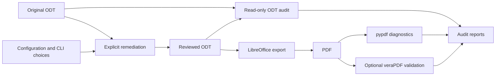

# Architecture

The CLI routes operations to separate package, audit, remediation and PDF layers.
All findings use the shared [report model](../src/odfa11y/report/models.py); rendering and
exit-status policy live in [report/render.py](../src/odfa11y/report/render.py).

The diagram shows responsibilities. The combined `pipeline` command gates export on the source audit; see the
[workflow contract](WORKFLOW.md#combined-commands).

## Packages and dependency rules

| Package | Responsibility |
| --- | --- |
| `odfa11y.safe_xml` | The one XML parser for untrusted input: no entity expansion, no network. |
| `odfa11y.report` | Findings, severities, the report container, text/JSON rendering and exit codes. |
| `odfa11y.odf` | ODT ZIP packages, XML namespaces, typed XPath selection, styles and visible text. |
| `odfa11y.audit` | Read-only ODT audit: package, metadata and semantic checks. |
| `odfa11y.remediation` | Explicit configuration, text-preserving edits and spacing normalization. |
| `odfa11y.pdf` | LibreOffice export, pypdf inspection and veraPDF invocation. |
| `odfa11y.cli` | Argument parsing, option assembly and command output. |

Dependencies point one way: `cli` uses `audit`, `remediation` and `pdf`; those use
`odf`, `report` and `safe_xml`. `audit`, `remediation` and `pdf` never import each other,
and `pdf` does not depend on `odf`. [tach.toml](../tach.toml) is the authority:
`tach check` rejects an undeclared dependency, a cycle, or an import that bypasses a
package's public interface. A package's public API is exactly what its `__init__.py`
re-exports; other modules inside a package are implementation details and use
unprefixed names for what their siblings share.

## Package boundary

[OdtPackage](../src/odfa11y/odf/package.py) loads ZIP members into memory, retains
archive order and metadata, and parses XML with entity resolution and network
access disabled. [Archive validation](../src/odfa11y/odf/archive.py) checks
CRC integrity and the ODT mimetype invariant. Saving writes to a temporary file
in the destination directory, validates it, then replaces the destination.

Member count and declared unpacked size are bounded before decompression. CRC checks
run while reading each member by its ZIP record; rewriting duplicate names is rejected.
These controls establish packaging properties, not a complete untrusted-document sandbox.

## Audit boundary

[ODT audit orchestration](../src/odfa11y/audit/odt.py) delegates package/version,
metadata and semantic checks to focused modules. Audits do not save the source.
Unparseable required members prevent dependent checks; optional schema validation
adds findings from supplied Relax NG validators.

Findings retain a rule ID, severity, message, location, details and `fixable` hint.
[The rule reference](RULES.md) describes the checks. The hint is not an automatic
repair plan or a guarantee that no human input is required.

## Editing boundary

[Remediation](../src/odfa11y/remediation/odt.py) applies explicit options, using separate
metadata and hyperlink helpers. [Configuration loading](../src/odfa11y/remediation/config.py)
validates TOML field names and types; [CLI options](../src/odfa11y/cli/options.py)
apply explicit overrides. Unmatched table/graphic identifiers are skipped.

[Style resolution](../src/odfa11y/odf/styles.py) overlays defaults and parent styles
from styles and content XML, stopping inheritance cycles.
[Spacing normalization](../src/odfa11y/remediation/spacing.py) creates distinct target styles
instead of globally rewriting the reference or base styles.

The shared [text snapshot](../src/odfa11y/odf/text.py) checks normalized
paragraph/heading text before saving. Its precise boundaries and the controlled spacer-removal
exception are documented in [Accessibility and limits](ACCESSIBILITY.md).

## PDF boundary

[Export](../src/odfa11y/pdf/export.py) and [validator invocation](../src/odfa11y/pdf/verapdf.py) use argument lists,
subprocess timeouts and a temporary LibreOffice profile. The exported PDF and ODT
are separate outputs; there is no rollback across pipeline stages.

[PDF diagnostics](../src/odfa11y/pdf/audit.py) read parsed objects with pypdf and securely
parse XMP XML. [Structure inspection](../src/odfa11y/pdf/structure.py) follows the
reachable structure tree, resolves role mappings and checks Figure descriptions.
It does not implement complete PDF/UA conformance; veraPDF supplies separate
machine-validation evidence when explicitly requested.

## Packaging boundary

[pyproject.toml](../pyproject.toml) is the authority for project metadata,
dependencies, development tool groups, lint, type-check and coverage settings and
Hatchling build selection. The version is read
from [the package initializer](../src/odfa11y/__init__.py), which holds only the version.
The wheel ships `py.typed`, so the annotations are part of the contract. There is no `setup.py`
or separate inclusion manifest. See [Development](DEVELOPING.md#packaging) for
source-archive and wheel contents.
